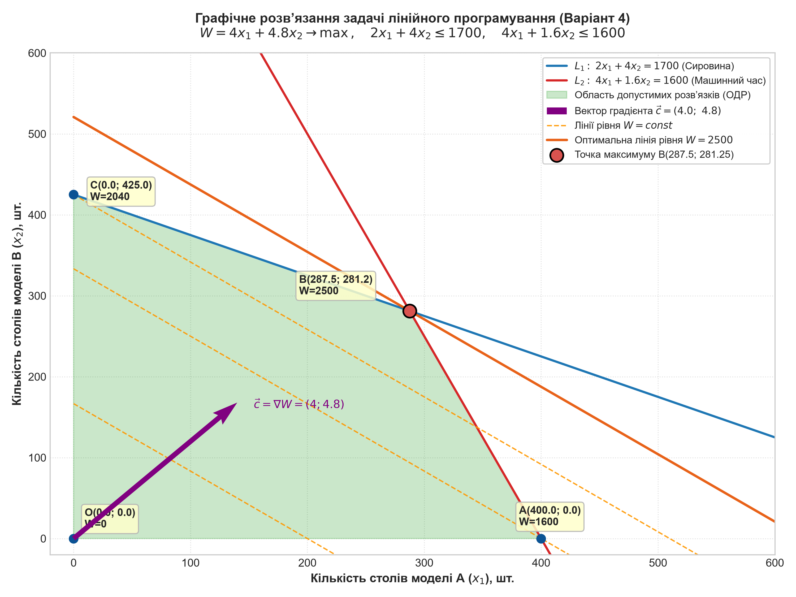

<div align="center">

### МІНІСТЕРСТВО ОСВІТИ І НАУКИ УКРАЇНИ
### КРЕМЕНЧУЦЬКИЙ НАЦІОНАЛЬНИЙ УНІВЕРСИТЕТ ІМЕНІ МИХАЙЛА ОСТРОГРАДСЬКОГО
#### НАВЧАЛЬНО-НАУКОВИЙ ІНСТИТУТ ЕЛЕКТРИЧНОЇ ІНЖЕНЕРІЇ ТА ІНФОРМАЦІЙНИХ ТЕХНОЛОГІЙ
#### КАФЕДРА АВТОМАТИЗАЦІЇ ТА ІНФОРМАЦІЙНИХ СИСТЕМ

<br><br>

### ОСВІТНІЙ КОМПОНЕНТ
### «ДОСЛІДЖЕННЯ ОПЕРАЦІЙ»

<br><br>

# ЗВІТ
### З ЛАБОРАТОРНОЇ РОБОТИ № 1
### Тема: Двомірна задача лінійного програмування
#### Варіант 4

<br><br><br>

<div align="right" style="text-align: right; width: 80%; margin-left: auto;">
  <p><b>Виконав:</b><br>
  здобувач групи КН-24-1<br>
  <b>Буханцев М. В.</b></p>
  <p><b>Перевірила:</b><br>
  доцент кафедри АІС<br>
  <b>Бурдільна Є. В.</b></p>
</div>

<br><br><br>

### Кременчук 2025
</div>

<hr style="border: 2px solid #003366; margin: 30px 0;">

## Лабораторна робота № 1

**Тема:** Двомірна задача лінійного програмування  
**Мета:** набути навичок з розв’язування двомірних задач лінійного програмування графічним методом.

---

## Хід роботи

### 1. Постановка задачі та вихідні дані

Підприємство випускає столи двох моделей: **А** і **В**.
- Для випуску одного столу моделі **А** потрібно $S_A$ одиниць сировини та $T_A$ одиниць машинного часу.
- Для випуску одного столу моделі **В** потрібно $S_B$ одиниць сировини та $T_B$ одиниць машинного часу.
- Прибуток від реалізації одного столу моделі **А** складає $W_A$ грошових одиниць, столу моделі **В** — $W_B$ грошових одиниць.
- На підприємстві наявні $1700$ одиниць сировини та $1600$ одиниць машинного часу.

Необхідно визначити оптимальний щоденний план виробництва (кількість столів моделі А та В), що забезпечує підприємству **максимальний сумарний прибуток**.

#### Розрахунок параметрів для Варіанта 4:
Згідно з Таблицею 1 методичних вказівок:
- $N = 4$ — номер студента у списку (варіант 4);
- $k = 1$ — коефіцієнт групи (підгрупа 1 групи КН-24-1).

$$S_A = 0.5 \cdot N \cdot k = 0.5 \cdot 4 \cdot 1 = 2.0 \text{ од. сировини}$$
$$T_A = \frac{N}{k} = \frac{4}{1} = 4.0 \text{ од. машинного часу}$$
$$S_B = N = 4.0 \text{ од. сировини}$$
$$T_B = 0.4 \cdot N \cdot k = 0.4 \cdot 4 \cdot 1 = 1.6 \text{ од. машинного часу}$$
$$W_A = N \cdot k = 4 \cdot 1 = 4.0 \text{ грош. од.}$$
$$W_B = 1.2 \cdot N \cdot k = 1.2 \cdot 4 \cdot 1 = 4.8 \text{ грош. од.}$$

Зведемо вихідні дані в Таблицю 1.

##### Таблиця 1 – Вихідні дані задачі оптимізації виробництва (Варіант 4)

| Показник | Стіл моделі А ($x_1$) | Стіл моделі В ($x_2$) | Наявний запас на підприємстві |
| :--- | :---: | :---: | :---: |
| Витрати сировини на 1 виріб, од. | $S_A = 2.0$ | $S_B = 4.0$ | $1700$ од. |
| Витрати машинного часу на 1 виріб, год. | $T_A = 4.0$ | $T_B = 1.6$ | $1600$ год. |
| Прибуток від реалізації 1 виробу, грош. од. | $W_A = 4.0$ | $W_B = 4.8$ | — |

---

### 2. Побудова економіко-математичної моделі ЗЛП

Введемо керуючі змінні:
- $x_1$ — запланований обсяг випуску столів моделі А, шт.;
- $x_2$ — запланований обсяг випуску столів моделі В, шт.

#### 1) Цільова функція:
Критерієм ефективності є максимізація сумарного прибутку $W(x_1, x_2)$:
$$W(x_1, x_2) = W_A x_1 + W_B x_2 = 4 x_1 + 4.8 x_2 \to \max$$

#### 2) Система обмежень за ресурсами:
- Обмеження щодо використання сировини:
  $$2 x_1 + 4 x_2 \le 1700$$
- Обмеження щодо використання фонду машинного часу:
  $$4 x_1 + 1.6 x_2 \le 1600$$

#### 3) Граничні умови невід'ємності:
Оскільки обсяги випуску не можуть бути від'ємними:
$$x_1 \ge 0, \quad x_2 \ge 0$$

---

### 3. Графічний розв’язок задачі лінійного програмування

Графічний метод базується на геометричній інтерпретації простору розв'язків на двомірній площині $O x_1 x_2$.

#### Крок 1. Побудова граничних прямих обмежень
Перетворимо нерівності системи обмежень у відповідні рівняння прямих:

1. **Пряма $L_1$ (межа запасу сировини):**
   $$2 x_1 + 4 x_2 = 1700 \implies x_2 = 425 - 0.5 x_1$$
   - При $x_1 = 0 \implies x_2 = 425$ (точка $C(0;\ 425)$);
   - При $x_2 = 0 \implies x_1 = 850$ (точка $(850;\ 0)$).
   Оскільки знак обмеження «$\le$», допустима півплощина лежить нижче прямої $L_1$ разом із початком координат $(0; 0)$.

2. **Пряма $L_2$ (межа машинного часу):**
   $$4 x_1 + 1.6 x_2 = 1600 \implies x_2 = 1000 - 2.5 x_1$$
   - При $x_1 = 0 \implies x_2 = 1000$ (точка $(0;\ 1000)$);
   - При $x_2 = 0 \implies x_1 = 400$ (точка $A(400;\ 0)$).
   Оскільки знак обмеження «$\le$», допустима півплощина лежить нижче прямої $L_2$.

3. **Осі координат:**
   - $x_1 \ge 0$ (півплощина праворуч від осі $O x_2$);
   - $x_2 \ge 0$ (півплощина вище осі $O x_1$).

#### Крок 2. Побудова області допустимих розв'язків (ОДР)
Перетин зазначених півплощин утворює опуклий замкнений чотирикутник $OABC$, вершинами якого є:
- $O(0;\ 0)$ — початок координат;
- $A(400;\ 0)$ — точка перетину прямої $L_2$ з віссю $O x_1$;
- $B(x_1^*;\ x_2^*)$ — точка взаємного перетину прямих обмежень $L_1$ та $L_2$;
- $C(0;\ 425)$ — точка перетину прямої $L_1$ з віссю $O x_2$.

#### Крок 3. Аналітичне визначення координат точки перетину $B$
Розв'яжемо систему лінійних алгебраїчних рівнянь:
$$\begin{cases} 2 x_1 + 4 x_2 = 1700 \\ 4 x_1 + 1.6 x_2 = 1600 \end{cases}$$

Помножимо перше рівняння на $2$:
$$4 x_1 + 8 x_2 = 3400$$

Віднімемо від нього друге рівняння:
$$(4 x_1 + 8 x_2) - (4 x_1 + 1.6 x_2) = 3400 - 1600$$
$$6.4 x_2 = 1800 \implies x_2 = \frac{1800}{6.4} = 281.25$$

Підставимо отримане значення $x_2$ у перше рівняння:
$$2 x_1 + 4(281.25) = 1700$$
$$2 x_1 + 1125 = 1700 \implies 2 x_1 = 575 \implies x_1 = 287.5$$

Отже, координати вершини $B$:
$$B = (287.5;\ 281.25)$$

#### Крок 4. Побудова градієнта та ліній рівня цільової функції
Вектор градієнта цільової функції $\vec{c} = \nabla W$:
$$\vec{c} = \left( \frac{\partial W}{\partial x_1}; \frac{\partial W}{\partial x_2} \right) = (4.0;\ 4.8)$$

Вектор $\vec{c}$ вказує напрямок найшвидшого зростання прибутку. Перпендикулярно до вектора $\vec{c}$ проходять лінії рівня цільової функції:
$$4 x_1 + 4.8 x_2 = \text{const}$$

При переміщенні лінії рівня від початку координат у напрямку вектора градієнта $\vec{c}$, останньою точкою області допустимих розв'язків, якої торкається лінія рівня перед виходом з ОДР, є саме **вершина $B(287.5;\ 281.25)$**.

Отримане графічне розв’язання представлено на Рисунку 1.

<div align="center">
  
  <p><b>Рисунок 1 – Графічне розв’язання задачі лінійного програмування (Варіант 4)</b></p>
</div>

---

### 4. Обчислення значень функції у вершинах багатокутника

Для перевірки глобального оптимуму обчислимо значення цільової функції $W = 4 x_1 + 4.8 x_2$ у всіх кутових точках ОДР:

1. **Точка $O(0;\ 0)$:**
   $$W(O) = 4(0) + 4.8(0) = 0 \text{ грош. од.}$$
2. **Точка $A(400;\ 0)$:**
   $$W(A) = 4(400) + 4.8(0) = 1600 \text{ грош. од.}$$
3. **Точка $C(0;\ 425)$:**
   $$W(C) = 4(0) + 4.8(425) = 2040 \text{ грош. од.}$$
4. **Точка $B(287.5;\ 281.25)$:**
   $$W(B) = 4(287.5) + 4.8(281.25) = 1150 + 1350 = 2500 \text{ грош. од.}$$

Порівняння підтверджує, що в точці **$B$** досягається максимальний прибуток:
$$W_{\max} = 2500 \text{ грошових одиниць}$$

---

### 5. Обчислення залишків ресурсів на складах

Підставимо оптимальний неперервний розв'язок $x_1^* = 287.5$, $x_2^* = 281.25$ у ліві частини рівнянь обмежень:

1. **Використання сировини:**
   $$S_{\text{вик}} = 2 \cdot 287.5 + 4 \cdot 281.25 = 575 + 1125 = 1700 \text{ од.}$$
   Залишок сировини:
   $$\Delta S = 1700 - 1700 = 0 \text{ од. (100% використання)}$$

2. **Використання фонду машинного часу:**
   $$T_{\text{вик}} = 4 \cdot 287.5 + 1.6 \cdot 281.25 = 1150 + 450 = 1600 \text{ год.}$$
   Залишок машинного часу:
   $$\Delta T = 1600 - 1600 = 0 \text{ год. (100% використання)}$$

**Висновок за ресурсами:** обидва види виробничих ресурсів підприємства за даного плану є критичними (дефіцитними) та використовуються на 100%, що свідчить про ідеальну збалансованість теоретичного плану.

---

### 6. Деталізований окіл оптимуму та цілочисельний розв'язок

Оскільки столи є неподільними виробами ($x_1, x_2 \in \mathbb{Z}$), проведемо аналіз допустимих цілочисельних планів в околі точки $B(287.5;\ 281.25)$.

<div align="center">
  
  <p><b>Рисунок 2 – Деталізований окіл точки оптимуму та цілочисельний аналіз дискретних точок</b></p>
</div>

Перевіримо найближчі цілочисельні вузли сітки:
- Вузол $(287;\ 281)$:
  - Сировина: $2(287) + 4(281) = 574 + 1124 = 1698 \le 1700$ (залишок $2$ од.);
  - Час: $4(287) + 1.6(281) = 1148 + 449.6 = 1597.6 \le 1600$ (залишок $2.4$ год.);
  - Прибуток: $W = 4(287) + 4.8(281) = 1148 + 1348.8 = 2496.8$ грн.
- Вузол $(286;\ 282)$:
  - Сировина: $2(286) + 4(282) = 572 + 1128 = 1700 \le 1700$ (залишок $0$ од.);
  - Час: $4(286) + 1.6(282) = 1144 + 451.2 = 1595.2 \le 1600$ (залишок $4.8$ год.);
  - Прибуток: $W = 4(286) + 4.8(282) = 1144 + 1353.6 = 2497.6$ грн.

Отже, найкращим **практичним цілочисельним планом** є випуск **$286$ столів моделі А** та **$282$ столів моделі В**, що дає прибуток **$2497.6$ грн** при повному використанні сировини та мінімальному недовантаженні машин ($4.8$ год із $1600$ год, тобто менше $0.3\%$).

---

### 7. Зведені результати розрахунків та рекомендації

<div align="center">
  
  <p><b>Рисунок 3 – Зведені показники розв’язку оптимізаційної задачі</b></p>
</div>

##### Таблиця 2 – Порівняльний аналіз оптимальних планів

| Параметр | Неперервний план ($x^*$) | Практичний цілочисельний план |
| :--- | :---: | :---: |
| Випуск столів моделі А ($x_1$), шт. | $287.50$ | $286$ |
| Випуск столів моделі В ($x_2$), шт. | $281.25$ | $282$ |
| **Максимальний прибуток ($W$), грн** | **$2500.00$** | **$2497.60$** |
| Використано сировини | $1700.0$ / $1700$ од. ($100\%$) | $1700.0$ / $1700$ од. ($100\%$) |
| Залишок сировини | $0.0$ од. | $0.0$ од. |
| Використано машинного часу | $1600.0$ / $1600$ год. ($100\%$) | $1595.2$ / $1600$ год. ($99.7\%$) |
| Залишок машинного часу | $0.0$ год. | $4.8$ год. |

#### Рекомендації щодо оптимізації виробництва:
1. **Збільшення прибутку за рахунок розширення "вузьких місць":**
   Оскільки сировина і машинний час повністю вичерпані, залучення додаткових $100$ од. сировини дозволить наростити обсяг випуску столів моделі В і збільшити сумарний прибуток.
2. **Організація виробничого циклу:**
   Рекомендується затвердити план виробництва у розмірі **286 столів моделі А** та **282 столів моделі В** щоденно або планувати виробництво 2-денними партіями (575 столів А та 563 столи В за 2 дні), що дозволить вийти на безвідходний графік з максимумом прибутку $5000$ грн за 2 доби.

---

### 8. Програмна реалізація мовою Python

Для розв'язання задачі, чисельної перевірки та автоматичної генерації графіків було розроблено програму на мові Python (файл `labs/lab1/solver.py`).

```python
import numpy as np
from scipy.optimize import linprog

# Параметри варіанта 4 (N = 4, k = 1)
N, k = 4, 1
S_A, T_A, W_A = 0.5 * N * k, N / k, N * k       # 2.0, 4.0, 4.0
S_B, T_B, W_B = float(N), 0.4 * N * k, 1.2 * N * k # 4.0, 1.6, 4.8

# Обмеження запасів
LIMIT_RAW, LIMIT_TIME = 1700.0, 1600.0

# 1. Аналітичний перетин
A_mat = np.array([[S_A, S_B], [T_A, T_B]])
b_vec = np.array([LIMIT_RAW, LIMIT_TIME])
x_opt = np.linalg.solve(A_mat, b_vec)
W_max = W_A * x_opt[0] + W_B * x_opt[1]

print(f"Аналітичний розв'язок: x1 = {x_opt[0]:.2f}, x2 = {x_opt[1]:.2f}, W_max = {W_max:.2f}")

# 2. Чисельна перевірка через SciPy Highs Solver
c = [-W_A, -W_B]
A_ub = [[S_A, S_B], [T_A, T_B]]
b_ub = [LIMIT_RAW, LIMIT_TIME]
bounds = [(0, None), (0, None)]

res_cont = linprog(c, A_ub=A_ub, b_ub=b_ub, bounds=bounds, method='highs')
res_int = linprog(c, A_ub=A_ub, b_ub=b_ub, bounds=bounds, integrality=[1, 1], method='highs')

print(f"SciPy неперервний: x = ({res_cont.x[0]:.2f}, {res_cont.x[1]:.2f}), W = {-res_cont.fun:.2f}")
print(f"SciPy цілочисельний: x = ({res_int.x[0]:.0f}, {res_int.x[1]:.0f}), W = {-res_int.fun:.2f}")
```

#### Результати роботи програми:
```
============================================================
ПАРАМЕТРИ ЗАВДАННЯ (Варіант 4: N=4, k=1):
Стіл А: сировина SA=2.0, час TA=4.0, прибуток WA=4.0
Стіл В: сировина SB=4.0, час TB=1.6, прибуток WB=4.8
Запаси: сировина = 1700.0, машинний час = 1600.0
============================================================
Вершини області допустимих розв'язків (ОДР):
  Вершина O(0.00, 0.00) -> W = 0.00 грн
  Вершина A(400.00, 0.00) -> W = 1600.00 грн
  Вершина B(287.50, 281.25) -> W = 2500.00 грн
  Вершина C(0.00, 425.00) -> W = 2040.00 грн

Неперервний оптимум: B(287.50, 281.25) з W = 2500.00 грн
Scipy перевірка (неперервний): x1=287.50, x2=281.25, W=2500.00
Scipy перевірка (цілочисельний): x1=286, x2=282, W=2497.60
Залишки (неперервний): сировина=0.00, машинний час=0.00
Залишки (цілочисельний): сировина=0.00, машинний час=4.80
```

---

### 9. Відповіді на контрольні питання

**1. Які задачі називають задачами лінійного програмування?**  
Задачами лінійного програмування (ЗЛП) називають оптимізаційні математичні задачі, в яких критерій ефективності (цільова функція) є лінійною функцією змінних керування, а множина допустимих значень визначається системою лінійних рівностей або нерівностей.

**2. Що таке цільова функція?**  
Цільова функція (критерій оптимальності, лінійна форма) — це математичний вираз, значення якого підлягає оптимізації (максимізації або мінімізації). У задачах планування виробництва вона відображає підсумковий економічний ефект, наприклад прибуток, вартість продукції або виручку.

**3. Як записуються рівняння обмеження?**  
Рівняння (або нерівності) обмежень записуються у вигляді алгебраїчних співвідношень:
$$\sum_{j=1}^{n} c_{ij} x_j \le S_i \quad (i = 1, \dots, m),$$
де $c_{ij}$ — норми витрат $i$-го ресурсу на одиницю $j$-го виду продукції, $x_j$ — обсяг випуску $j$-ї продукції, $S_i$ — наявний запас (ліміт) $i$-го ресурсу на складі.

**4. Які обмеження обов’язково застосовуються до задач оптимального виробництва?**  
До обов'язкових обмежень належать:
1. Ресурсні обмеження (витрати матеріалів, людино-годин, фонду обладнання не можуть перевищувати наявні фонди);
2. Умови невід'ємності змінних ($x_j \ge 0, \forall j$), оскільки неможливо виробити від'ємну кількість фізичної продукції;
3. За необхідності — вимоги цілочисельності змінних ($x_j \in \mathbb{Z}$), коли вироби є неподільними (наприклад, меблі, верстати, автомобілі).

**5. Який розв’язок ЗЛП називають оптимальним?**  
Оптимальним розв’язком називається такий допустимий вектор значень керуючих змінних $X^* = (x_1^*, x_2^*, \dots, x_n^*)$, який належить області допустимих розв'язків і при якому цільова функція досягає свого екстремального (максимального чи мінімального) значення.

**6. Надайте геометричну інтерпретацію ЗЛП.**  
Геометрично кожне лінійне обмеження визначає замкнену півплощину на площині. Їх спільний перетин утворює опуклий багатокутник (ОДР). Цільова функція задає сімейство паралельних прямих (ліній рівня), перпендикулярних до вектора градієнта. Оптимальний розв'язок відповідає точці дотику лінії рівня найбільшого значення з межею цього багатокутника.

**7. Яка точка допустимої множини розв’язку називається кутовою?**  
Кутовою точкою (вершиною багатокутника допустимих розв’язків) називається точка допустимої множини, яка не може бути представлена як опукла лінійна комбінація двох інших відмінних точок цієї множини. Згідно з фундаментальною теоремою лінійного програмування, оптимальний розв'язок ЗЛП завжди досягається щонайменше в одній з кутових точок.

**8. Поясніть алгоритм графічного методу розв’язання ЗЛП.**  
1. Скласти математичну модель задачі (цільова функція, система нерівностей, умови невід'ємності);
2. Замінити нерівності обмежень на рівності та побудувати відповідні прямі в декартовій системі координат;
3. Для кожної прямої визначити допустиму півплощину та побудувати спільну область допустимих розв'язків (багатокутник ОДР);
4. Побудувати вектор градієнта цільової функції $\vec{c} = (\partial W / \partial x_1; \partial W / \partial x_2)$;
5. Побудувати базову лінію рівня (перпендикуляр до градієнта), що проходить через початок координат;
6. Переміщувати лінію рівня паралельно самій собі в напрямку градієнта (для максимізації) до виходу з ОДР;
7. Знайти останню опорну точку дотику лінії рівня з багатокутником — координати цієї вершини і є шуканим оптимумом;
8. Обчислити точні координати розв'язком відповідної СЛАР та визначити екстремальне значення цільової функції.

---

## Висновки

1. У процесі виконання лабораторної роботи було вивчено теоретичні основи та практичні особливості застосування графічного методу розв'язання двомірних задач лінійного програмування (ЗЛП).
2. За індивідуальними даними **Варіанта 4** ($N=4, k=1$) складено економіко-математичну модель виробництва двох моделей столів із цільовою функцією прибутку $W = 4 x_1 + 4.8 x_2 \to \max$ та обмеженнями на запаси сировини ($1700$ од.) і фонд машинного часу ($1600$ год.).
3. Побудовано область допустимих розв'язків у вигляді опуклого багатокутника $OABC$ з вершинами $O(0; 0)$, $A(400; 0)$, $B(287.5; 281.25)$ та $C(0; 425)$.
4. За допомогою вектора градієнта $\vec{c} = (4.0; 4.8)$ та сімейства ліній рівня визначено крайню опорну точку $B(287.5; 281.25)$, що забезпечує глобальний максимум прибутку **$W_{\max} = 2500$ грошових одиниць**.
5. Аналіз використання виробничих ресурсів показав, що при неперервному оптимальному плані сировина та машинний час використовуються на $100\%$, залишки на складах дорівнюють нулю.
6. Проведено аналіз цілочисельного плану для практичного випуску неподільних виробів: випуск **$286$ столів моделі А** та **$282$ столів моделі В** забезпечує щоденний прибуток **$2497.6$ грн** при збереженні безвідходного використання сировини та недовантаженні обладнання лише на $0.3\%$.
7. Результати графічного та аналітичного розв'язку повністю підтверджені програмним розрахунком у середовищі Python за допомогою модуля `scipy.optimize.linprog`.
