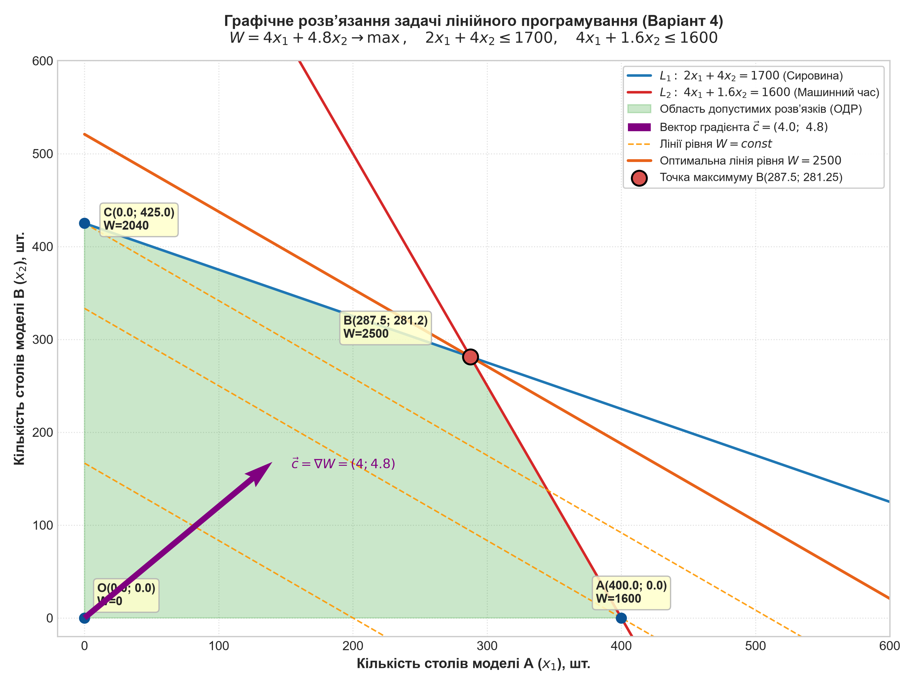
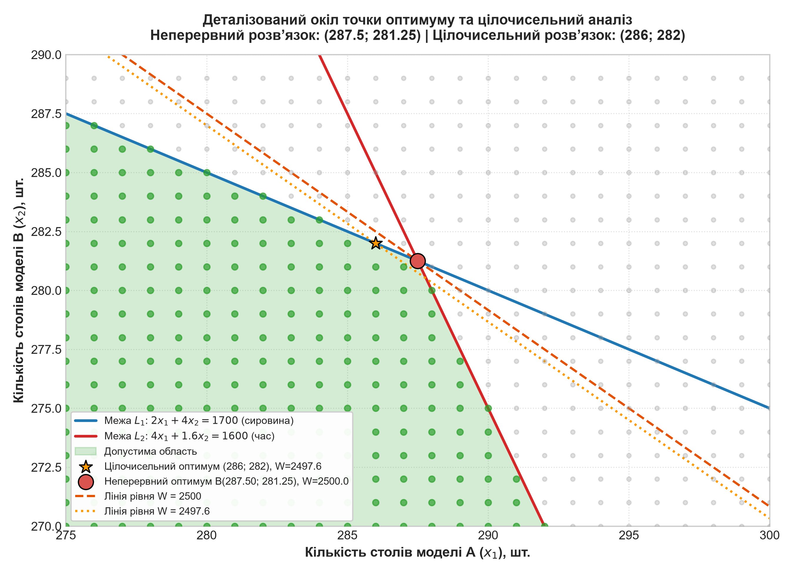
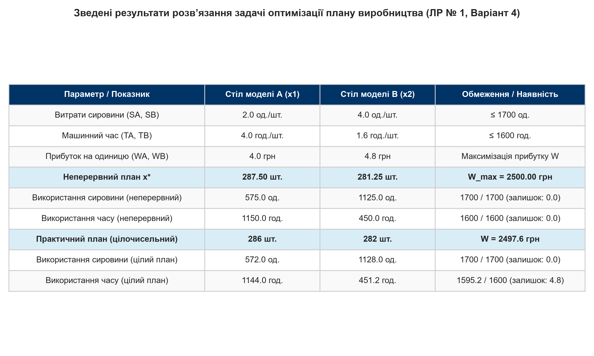

<div align="center">

МІНІСТЕРСТВО ОСВІТИ І НАУКИ УКРАЇНИ  
КРЕМЕНЧУЦЬКИЙ НАЦІОНАЛЬНИЙ УНІВЕРСИТЕТ ІМЕНІ МИХАЙЛА ОСТРОГРАДСЬКОГО  
НАВЧАЛЬНО-НАУКОВИЙ ІНСТИТУТ ЕЛЕКТРИЧНОЇ ІНЖЕНЕРІЇ ТА ІНФОРМАЦІЙНИХ ТЕХНОЛОГІЙ  
КАФЕДРА АВТОМАТИЗАЦІЇ ТА ІНФОРМАЦІЙНИХ СИСТЕМ  

<br>

ОСВІТНІЙ КОМПОНЕНТ  
**«ДОСЛІДЖЕННЯ ОПЕРАЦІЙ»**  

<br>

**ЗВІТ**  
З ЛАБОРАТОРНОЇ РОБОТИ № 1  
**«ДВОМІРНА ЗАДАЧА ЛІНІЙНОГО ПРОГРАМУВАННЯ»**  
**Варіант № 4**  

</div>

<br>

<div align="right">

**Виконав:**  
здобувач групи КН-24-1  
**Буханцев М. В.**  

**Перевірила:**  
доцент кафедри АІС  
**Бурдільна Є. В.**  

</div>

<br>

<p align="center">Кременчук 2026</p>

---

[← До переліку лабораторних](../../README.md) · [📄 Завантажити звіт у PDF](./Звіт_ЛР1_Буханцев.pdf) · [💻 Код програми](./src/solve_lab1.py)

---

## Зміст

1. [Тема та мета](#1-тема-та-мета)
2. [Постановка задачі](#2-постановка-задачі)
3. [Вихідні дані](#3-вихідні-дані)
4. [Математична модель](#4-математична-модель)
5. [Графічний розв'язок](#5-графічний-розвязок)
6. [Прибуток і залишки ресурсів](#6-прибуток-і-залишки-ресурсів)
7. [Практичний цілочисельний план](#7-практичний-цілочисельний-план)
8. [Аналіз результатів та рекомендації](#8-аналіз-результатів-та-рекомендації)
9. [Контрольні питання](#9-контрольні-питання)
10. [Висновки](#10-висновки)
11. [Запуск програми](#11-запуск-програми)

---

## 1. Тема та мета

**Тема:** Двомірна задача лінійного програмування  
**Мета:** набути навичок з розв’язування двомірних задач лінійного програмування графічним методом.

---

## 2. Постановка задачі

Підприємство випускає столи двох моделей: **А** і **В**.
- Для випуску одного столу моделі А потрібно $S_A$ одиниці сировини та $T_A$ одиниці машинного часу.
- Для випуску одного столу моделі В потрібно $S_B$ одиниці сировини та $T_B$ одиниць машинного часу.
- Прибуток від реалізації одного столу моделі А складає $W_A$ грошових одиниць, столу моделі В — $W_B$ грошових одиниць.
- На підприємстві наявні $1700$ одиниць сировини та $1600$ одиниць машинного часу.

**Завдання:**
1. Скласти таблицю вихідних даних за індивідуальним варіантом.
2. Скласти математичну модель задачі лінійного програмування (ЗЛП).
3. Отримати розв’язок ЗЛП графічним методом.
4. Обчислити прогнозований максимальний прибуток.
5. Обчислити залишки ресурсів на складах.
6. Проаналізувати отримані результати і зробити рекомендації щодо оптимізації виробництва.

---

## 3. Вихідні дані

Параметри для **Варіанта 4** ($N = 4$ — номер у списку, $k = 1$ — коефіцієнт підгрупи):

- $S_A = 0.5 \cdot N \cdot k = 0.5 \cdot 4 \cdot 1 = 2.0$ од. сировини;
- $T_A = N / k = 4 / 1 = 4.0$ год. машинного часу;
- $S_B = N = 4.0$ од. сировини;
- $T_B = 0.4 \cdot N \cdot k = 0.4 \cdot 4 \cdot 1 = 1.6$ год. машинного часу;
- $W_A = N \cdot k = 4 \cdot 1 = 4.0$ грн;
- $W_B = 1.2 \cdot N \cdot k = 1.2 \cdot 4 \cdot 1 = 4.8$ грн;
- Запаси: сировина — $1700$ од., машинний час — $1600$ год.

### Таблиця 1 – Вихідні дані (Варіант 4)

| Показник | Стіл моделі А ($x_1$) | Стіл моделі В ($x_2$) | Наявний запас |
| :--- | :---: | :---: | :---: |
| Витрати сировини на 1 виріб, од. | $2.0$ | $4.0$ | $1700$ од. |
| Витрати машинного часу на 1 виріб, год. | $4.0$ | $1.6$ | $1600$ год. |
| Прибуток від 1 виробу, грош. од. | $4.0$ | $4.8$ | — |

---

## 4. Математична модель

Нехай:
- $x_1$ — кількість виготовлених столів моделі А, шт.;
- $x_2$ — кількість виготовлених столів моделі В, шт.

### Цільова функція:
$$W(x_1, x_2) = 4.0 x_1 + 4.8 x_2 \to \max$$

### Система обмежень:
$$\begin{cases} 2.0 x_1 + 4.0 x_2 \le 1700 & \text{(сировина)} \\ 4.0 x_1 + 1.6 x_2 \le 1600 & \text{(машинний час)} \end{cases}$$

### Умови невід'ємності:
$$x_1 \ge 0, \quad x_2 \ge 0$$

---

## 5. Графічний розв'язок

1. **Граничні прямі обмежень:**
   - Пряма $L_1$ (сировина): $2 x_1 + 4 x_2 = 1700 \implies x_2 = 425 - 0.5 x_1$. Точки: $(0;\ 425)$ та $(850;\ 0)$.
   - Пряма $L_2$ (машинний час): $4 x_1 + 1.6 x_2 = 1600 \implies x_2 = 1000 - 2.5 x_1$. Точки: $(0;\ 1000)$ та $(400;\ 0)$.

2. **Область допустимих розв'язків (ОДР):**
   Утворює чотирикутник $OABC$ з вершинами:
   - $O(0;\ 0)$
   - $A(400;\ 0)$
   - $B(x_1^*;\ x_2^*)$ — точка перетину прямих $L_1$ та $L_2$
   - $C(0;\ 425)$

3. **Координати точки перетину $B$:**
   $$\begin{cases} 2 x_1 + 4 x_2 = 1700 \\ 4 x_1 + 1.6 x_2 = 1600 \end{cases} \implies x_1^* = 287.5, \quad x_2^* = 281.25$$

4. **Вектор градієнта та лінії рівня:**
   $$\vec{c} = \nabla W = (4.0;\ 4.8)$$
   Зміщуючи лінію рівня $4 x_1 + 4.8 x_2 = \text{const}$ у напрямку вектора $\vec{c}$, крайньою точкою виходу з ОДР є вершина **$B(287.5;\ 281.25)$**.


*Рисунок 1 – Графічне розв’язання задачі лінійного програмування (Варіант 4)*

---

## 6. Прибуток і залишки ресурсів

### Значення цільової функції у кутових точках:
- $W(O) = 4(0) + 4.8(0) = 0$ грн;
- $W(A) = 4(400) + 4.8(0) = 1600$ грн;
- $W(C) = 4(0) + 4.8(425) = 2040$ грн;
- $W(B) = 4(287.5) + 4.8(281.25) = 1150 + 1350 = \mathbf{2500.00}$ грн.

**Максимальний прибуток:** $W_{\max} = 2500.00$ грн.

### Залишки ресурсів:
- Сировина: $1700 - (2 \cdot 287.5 + 4 \cdot 281.25) = 1700 - 1700 = \mathbf{0}$ од. (використано $100\%$).
- Машинний час: $1600 - (4 \cdot 287.5 + 1.6 \cdot 281.25) = 1600 - 1600 = \mathbf{0}$ год. (використано $100\%$).

---

## 7. Практичний цілочисельний план

Оскільки столи виготовляються цілими штуками ($x_1, x_2 \in \mathbb{Z}$), досліджено цілочисельні вузли в околі точки $B$:


*Рисунок 2 – Деталізований окіл точки оптимуму та цілочисельний аналіз*

Найкращим є допустимий вузол **$(286;\ 282)$**:
- Випуск: $286$ столів А, $282$ столи В;
- Прибуток: $W = 4(286) + 4.8(282) = \mathbf{2497.60}$ грн;
- Залишок сировини: $0$ од. ($100\%$ використання);
- Залишок машинного часу: $4.8$ год. (недовикористання лише $0.3\%$).

---

## 8. Аналіз результатів та рекомендації


*Рисунок 3 – Зведені показники розв’язку оптимізаційної задачі*

### Таблиця 2 – Порівняння планів

| Показник | Неперервний розв'язок ($x^*$) | Практичний цілочисельний план |
| :--- | :---: | :---: |
| Столи моделі А ($x_1$), шт. | $287.50$ | $286$ |
| Столи моделі В ($x_2$), шт. | $281.25$ | $282$ |
| **Максимальний прибуток ($W$), грн** | **$2500.00$** | **$2497.60$** |
| Залишок сировини | $0.0$ од. ($100\%$) | $0.0$ од. ($100\%$) |
| Залишок машинного часу | $0.0$ год. ($100\%$) | $4.8$ год. ($99.7\%$) |

### Рекомендації:
Обидва ресурси використовуються на $100\%$ та є дефіцитними. Збільшити прибуток можливо шляхом закупівлі додаткової сировини та розширення машинного парку. Для практичного виробництва рекомендовано щоденний план випуску **286 столів А** та **282 столів В**.

---

## 9. Контрольні питання

1. **Які задачі називають задачами лінійного програмування?**  
   Оптимізаційні задачі з лінійною цільовою функцією та системою лінійних обмежень (рівностей або нерівностей).

2. **Що таке цільова функція?**  
   Функція залежності критерію ефективності від керованих змінних, екстремум якої (максимум чи мінімум) є метою оптимізації.

3. **Як записуються рівняння обмеження?**  
   У вигляді $\sum_{j=1}^n c_{ij} x_j \le S_i$ або $\sum_{j=1}^n c_{ij} x_j = S_i$, де $c_{ij}$ — норми витрат, $S_i$ — запаси ресурсів.

4. **Які обмеження обов’язково застосовуються до задач оптимального виробництва?**  
   Обмеження на наявні ресурси, невід'ємність змінних $x_j \ge 0$ та за необхідності цілочисельність.

5. **Який розв’язок ЗЛП називають оптимальним?**  
   План з області допустимих розв'язків, що забезпечує екстремальне значення цільової функції.

6. **Надайте геометричну інтерпретацію ЗЛП.**  
   Пошук вершини опуклого багатокутника (ОДР), якої останньою торкається лінія рівня при її русі в напрямку вектора градієнта.

7. **Яка точка допустимої множини розв’язку називається кутовою?**  
   Вершина багатокутника допустимих розв'язків, яка не може бути представлена як опукла лінійна комбінація двох інших точок цієї множини.

8. **Поясніть алгоритм графічного методу розв’язання ЗЛП.**  
   Побудова прямих обмежень $\to$ знаходження багатокутника ОДР $\to$ побудова градієнта $\vec{c} \to$ рух лінії рівня до виходу з ОДР $\to$ визначення координат точки контакту та значення функції.

---

## 10. Висновки

1. За індивідуальними даними Варіанта 4 ($N=4, k=1$) побудовано економіко-математичну модель $W = 4 x_1 + 4.8 x_2 \to \max$.
2. Графічним методом знайдено оптимальний план $B(287.50;\ 281.25)$ з максимальним прибутком **$2500.00$ грн**.
3. Усі ресурси (сировина та машинний час) використовуються на $100\%$ без залишків.
4. Знайдено практичний цілочисельний план: **$286$ столів А** та **$282$ столи В** ($W = 2497.60$ грн, використання сировини $100\%$, машинного часу $99.7\%$).
5. Розрахунки верифіковано мовою Python через `scipy.optimize.linprog`.

---

## 11. Запуск програми

```bash
# Встановлення бібліотек
pip install -r requirements.txt

# Запуск розрахунку
python src/solve_lab1.py
```
